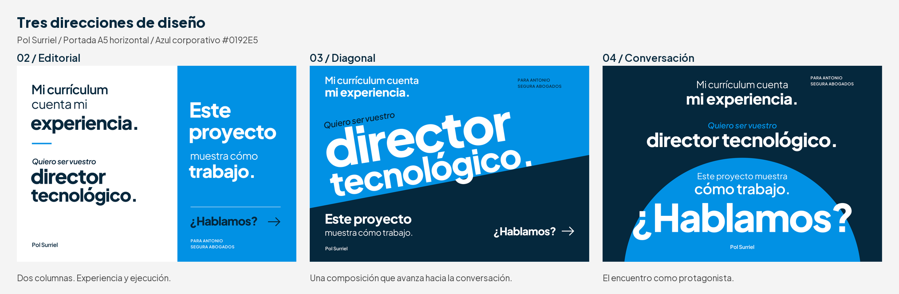

# Portada elegida: 03 diagonal · Variantes conservadas

Propuestas para **Pol Surriel Muixench**, con firma **Pol Surriel**, dirigidas
a **Antonio Segura Abogados**. Actualizado el 17 de septiembre de 2026.

**Pol ha elegido la portada 03, diagonal.**
[PDF elegido](03-diagonal.pdf) · [Vista previa](03-diagonal.png).
Las demás composiciones se conservan para referencia y exploración de variantes.
La preparación del diseño elegido con sangrado sigue pendiente; no se han
regenerado los archivos por esta selección.

Pol pidió variantes de diseño completas. Los cambios 1A/1B/1C que solo
modificaban la frase inicial no respondían a esa petición y se han apartado.
La portada 1 se conserva como referencia. Se presentan **tres composiciones
independientes**, con distribución, jerarquía y campos de color propios.

## Comparar las nuevas propuestas



| Diseño | Composición | PDF | Vista previa |
| --- | --- | --- | --- |
| 02. Editorial | Dos columnas: experiencia y aspiración sobre blanco; prueba de trabajo e invitación sobre azul | [PDF](02-editorial-dos-columnas.pdf) | [PNG](02-editorial-dos-columnas.png) |
| 03. Diagonal | Titular inclinado y un corte oblicuo entre el azul corporativo y el oscuro | [PDF](03-diagonal.pdf) | [PNG](03-diagonal.png) |
| 04. Conversación | Texto centrado sobre azul oscuro; un semicírculo corporativo enmarca un «¿Hablamos?» de gran escala | [PDF](04-conversacion.pdf) | [PNG](04-conversacion.png) |

En 02 el recorrido pasa de la columna izquierda a la derecha. En 03 la
aspiración recorre la diagonal antes del bloque de prueba e invitación.
En 04 el texto avanza por un eje central y culmina en la conversación como
elemento de mayor escala. La primera frase tiene protagonismo en las tres.

La 03 es la dirección elegida; 01, 02 y 04 quedan como variantes conservadas.
Los números 02 a 04
corresponden a estos nuevos archivos horizontales y no recuperan los antiguos
bocetos verticales, que siguen eliminados.

## Referencia: portada 1

Se conserva la composición de cartel con franja blanca:

- [PDF de revisión](01-horizontal-director-tecnologico.pdf).
- [Vista previa](01-horizontal-director-tecnologico.png).
- [PDF con 3 mm de sangrado](01-horizontal-director-tecnologico-sangrado.pdf).

Los ajustes menores de cabecera se encuentran en
`descartadas/ajustes-de-cabecera/`; no forman parte de la comparativa actual.

## Texto y recursos

> Mi currículum cuenta mi experiencia.
>
> Quiero ser vuestro director tecnológico.
>
> Este proyecto muestra cómo trabajo.
>
> ¿Hablamos?
>
> Pol Surriel

Las composiciones conservan estas palabras, adaptando los saltos de línea
y la posición de cada bloque. Se añade el destinatario en pequeño.

El azul corporativo es **#0192E5**, identificado en
[el CSS guardado de la web](../../../recursos-compartidos/investigacion/web/avada.css)
como `--primary_color`. Se combina con blanco y azul oscuro **#06283D**.
Plus Jakarta Sans y los colores proceden de los recursos compartidos.

## Formato y revisión

Los tres PDF nuevos tienen una página A5 horizontal de **210 × 148 mm**,
texto vectorial y fuentes incrustadas. Los PNG tienen 240 ppp; la comparativa
sirve para revisión en pantalla.

Verificados texto completo, tamaño, fuentes, ausencia de recortes y composición
visual. El diseño 03 está seleccionado. Su sangrado y la
prueba física se prepararán en la fase de producción. La portada 1 conserva una exportación
con 3 mm de sangrado provisionales; los colores siguen en RGB y no son PDF/X.

La demo y el CV siguen pendientes. El texto describe la candidatura en el
momento de entrega, cuando sus materiales estén listos.

## Regenerar

Desde esta carpeta, con Python 3 y un entorno virtual:

```sh
python3 -m venv .venv
.venv/bin/python -m pip install -r requirements.txt
.venv/bin/python generar-disenos.py
```

`generar-disenos.py` contiene una función de composición distinta para cada
diseño. Comparte con `generar-horizontal.py` únicamente utilidades de fuente,
color, texto, formato y verificación. Genera tres PDF, sus PNG y la comparativa.

Para reproducir la portada 1 de referencia:
`.venv/bin/python generar-horizontal.py`.

Las instancias estáticas de las fuentes se crean en una carpeta temporal y
se eliminan al terminar. No se han copiado fuentes ni paletas al directorio.
